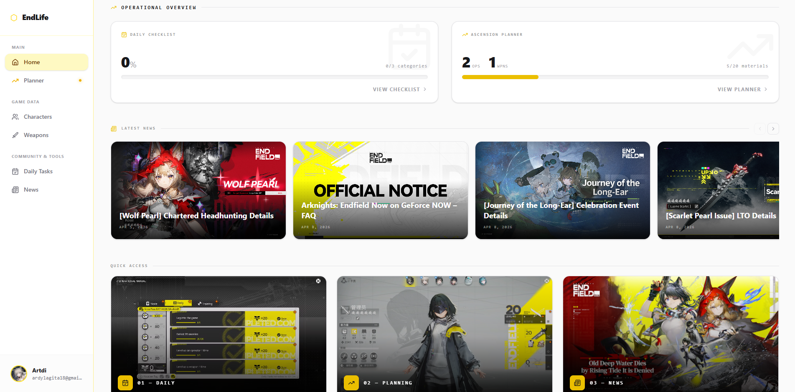

 

---

## 🐧 &nbsp; OPERATOR DOSSIER - CLASSIFIED

> *Authorization required. Document sealed by Penguin Logistics Command, Lungmen Branch.*
> *Unauthorized access is punishable under Article 7 of the P.L. Internal Charter - which nobody has actually read.*

<table><tr><td align="center">

</td></tr></table>

 

<table width="100%">
<tr>
<td width="58%" valign="top">

**PENGUIN LOGISTICS — PERSONNEL FILE — OPERATOR #204**

| Field | Detail |
|:---|:---|
| Codename | Artdi |
| Faction | Penguin Logistics (P.L.) |
| Division | Digital Infrastructure |
| Specialty | Fullstack Deployment |
| Node | Lungmen Territory |
| Affiliation | Emperor's Network |

> *"I deliver code. Clean, fast, on time. No returns. No questions asked."*

</td>
<td width="42%" align="center" valign="top">

 

</td>
</tr>
</table>

---

## 📦 &nbsp; FIELD REPORT - DISPATCH LOG

> *Entry logged by: Dispatch Terminal - Lungmen Branch, The Ends of the Earth*
> *Timestamp: Active. Operator on-site. Coffee: Missing. ETA: Unknown.*

Currently on assignment building **EndLife** - a full **Arknights: Endfield** database & operator planning tool, engineered for operators in the field. Off-duty hours are spent mastering the **ElysiaJS + Next.js** type-safe pipeline, hardening systems with **JWT & Middleware**, and pushing the limits of **React v19**. Rhythm game APM exceeds WPM. Texas can confirm.

> *"For many Messengers, getting into trouble equates to failure. For Penguin Logistics, it's simply part of the job."*

<b>⚡ Full Operator Trait File - [ EXPAND DOSSIER ]</b>

 

**P.L. INTERNAL MEMO — FOR AUTHORIZED EYES ONLY**

| Memo Field | Detail |
|:---|:---|
| Active Mission | EndLife (Arknights: Endfield) |
| Primary Stack | ElysiaJS + Next.js (Type-Safe) |
| React Expertise | v19 — deployed faster than Exusiai's trigger finger |
| Security Layer | JWT + Middleware hardening |
| Field Specialty | TypeScript / Bun runtime |
| Classified Intel | Rhythm game APM > WPM (fact) |

---

## 🛠️ &nbsp; OPERATOR LOADOUT - TECH STACK

> *Equipment certified for field operations by P.L. Logistics Command*

**Frontend Arsenal**

**Backend & Infrastructure**

 

| 🖥️ **Frontend Arsenal** | ⚙️ **Backend Gear** | 🗄️ **Infrastructure** |
|:---|:---|:---|
|  Next.js |  ElysiaJS |  PostgreSQL |
|  React v19 |  Bun Runtime |  Supabase |
|  Tailwind v4 |  JWT Auth |  Git |
|  Framer Motion |  Eden Treaty |  Figma |
|  Zustand |  Node.js |  Postman |

---

## 🚚 &nbsp; ACTIVE OPERATIONS - DELIVERY LOG

**P.L. DISPATCH SYSTEM — ACTIVE PACKAGE TRACKER**

| Field | Detail |
|:---|:---|
| Package | #001 — Priority Shipment |
| Recipient | Arknights: Endfield Community |
| Contents | Full database + interactive operator planner |
| Status | In Transit — build phase ongoing |
| ETA | When it ships. Don't rush the courier. |

<table width="100%">
<tr>
<td width="50%" valign="top">

### 📦 EndLife
> *Priority Shipment - Penguin Logistics Classified*

A comprehensive **Arknights: Endfield** database & operator planner, engineered with the full type-safe stack. No ETAs. No compromises.

**Stack:** `Next.js` · `ElysiaJS` · `Bun` · `PostgreSQL` · `Supabase`

</td>
<td width="50%" valign="top">

### 📪 PARCEL SLOT - RESERVED
> *Next delivery pending...*

**Parcel slot available.** Next shipment incoming — stay tuned, Operator.

</td>
</tr>
</table>

---

## 📊 &nbsp; COMBAT RECORD - PERFORMANCE METRICS

  

**🏆 Field Commendations**

 

&nbsp;&nbsp;

  

**🐍 P.L. Delivery Route - Daily Run**

<picture>
  <source media="(prefers-color-scheme: dark)" srcset="https://raw.githubusercontent.com/Artdi222/Artdi222/output/github-snake-dark.svg" />
  <source media="(prefers-color-scheme: light)" srcset="https://raw.githubusercontent.com/Artdi222/Artdi222/output/github-snake.svg" />
  
</picture>

 

---

## 🎴 &nbsp; FIELD GALLERY - VISUAL INTEL

> *P.L. media archive - Lungmen Branch internal records*

<table width="100%">
<tr>

<td width="33%" align="center">
 
<i>Texas Cellinia</i>
</td>

<td width="33%" align="center">
 
<i>Lemuel a.k.a Exusiai</i>
</td>

<td width="33%" align="center">
 
<i>Mostima </i>
</td>
</table>

 

---

## 🎧 &nbsp; COMMS CHANNEL - NOW PLAYING

> *Optional dispatch frequency. Activate once linked to broadcast live listening status.*

<!--
  Setup (takes ~2 minutes, see chat for full steps):
  1. Visit https://spotify-github-profile.kittinanx.com/api/login and connect your Spotify account.
  2. Copy the "uid" value it gives you back.
  3. Uncomment the line below and replace YOUR_UID with that value.

  
-->

---

## 📡 &nbsp; OPEN CHANNEL - CONTACT DISPATCH

> *Penguin Logistics accepts all transmissions. Encryption optional. Emperor's terms apply.*

 

---

**PENGUIN LOGISTICS — LUNGMEN BRANCH DISPATCH**
*Est. Terran Year 1093*

> "Whether it's code, packages, or chaos — we deliver."
>
> "For many Messengers, getting into trouble equates to failure. For Penguin Logistics, it's simply part of the job."

**Operator Artdi**  ·  Signing off  ·  See you next deployment

